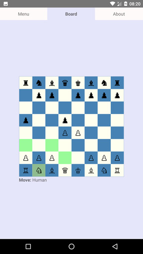
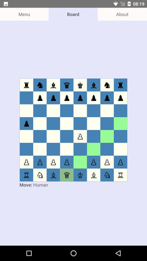
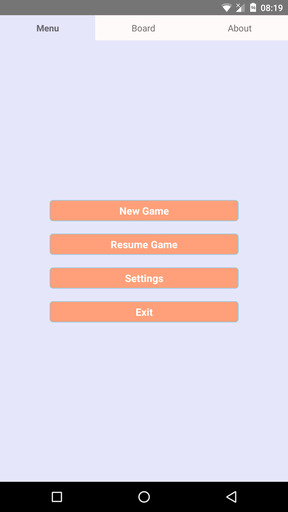
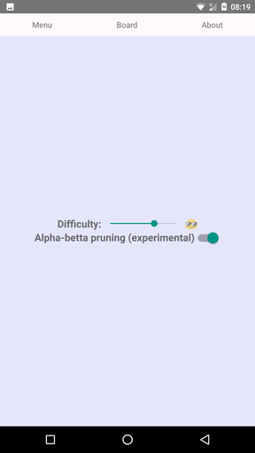

## chess react native
A demo project for my [JavaScript chess engine](https://github.com/venil7/chess)

To compile and run:

```
  $ react-native start
  $ react-native run-android
  $ react-native run-ios
```

To produce a `debug` APK:

```
  cd android && ./gradlew assembleDebug
```
find APK in `app/build/outputs/apk`


Alernatively download from [Play Store](https://play.google.com/store/apps/details?id=uk.co.darkruby.chess)


### screenshots





